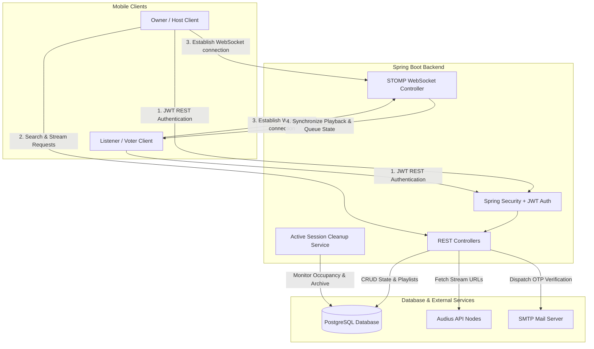

# 🎵 MusicRoom

[](https://flutter.dev)
[](https://spring.io/projects/spring-boot)
[](https://www.postgresql.org)
[](https://openjdk.org)
[](LICENSE)

**MusicRoom** is a premium, high-fidelity, real-time collaborative music streaming and sharing platform. Built with a robust **Spring Boot (Java 21)** backend and a beautiful, theme-aware **Flutter** mobile client, it empowers users to host live music rooms, collaborate on playlists with friends, vote on upcoming tracks, and stream high-quality audio in perfect synchronization. 

---

## 📱 Visual Showcase

Explore the stunning, theme-aware user interface designed for maximum engagement, high-performance interactions, and modern design aesthetics.

### 🏠 The Core Hub & Music discovery
Discover popular music, jump back into your curated library, or find active live sessions directly from the landing dashboard.

<table width="100%">
  <tr>
    <td width="33%" align="center">
      <b>Home Feed</b><br/>
      
      <br/><i>Access trending tracks, personal playlists, and ongoing live events in one dynamic view.</i>
    </td>
    <td width="33%" align="center">
      <b>Trending Tracks</b><br/>
      
      <br/><i>Explore viral global hits and immediately listen to high-quality audio.</i>
    </td>
    <td width="33%" align="center">
      <b>Decentralized Search</b><br/>
      
      <br/><i>Instant, fuzzy track searching powered by the Audius music catalog.</i>
    </td>
  </tr>
</table>

### 👥 Collaboration & Live Rooms
Host collaborative parties, manage listener capabilities, and invite friends to enjoy synchronized music.

<table width="100%">
  <tr>
    <td width="33%" align="center">
      <b>Live Music Room</b><br/>
      
      <br/><i>Stream in real-time, vote on the queue, and suggest new tracks collaboratively.</i>
    </td>
    <td width="33%" align="center">
      <b>Collaborator Permissions</b><br/>
      
      <br/><i>Assign roles dynamically (Owner, Editor, Voter) to manage playback and suggestions.</i>
    </td>
    <td width="33%" align="center">
      <b>Invite Friends</b><br/>
      
      <br/><i>Quickly search for registered platform users and add them to your collaborative rooms.</i>
    </td>
  </tr>
</table>

### ⚙️ Library, Configuration & Settings
Organize your spaces, update privacy preferences, and custom tailor your identity.

<table width="100%">
  <tr>
    <td width="33%" align="center">
      <b>Your Library</b><br/>
      
      <br/><i>A unified dashboard displaying all playlists you own or collaborate on.</i>
    </td>
    <td width="33%" align="center">
      <b>Create Playlist or Event</b><br/>
      
      <br/><i>Instantly initialize a shared music playlist or launch a public/private live party.</i>
    </td>
    <td width="33%" align="center">
      <b>User Profile</b><br/>
      
      <br/><i>Manage personal information, accounts, active states, and custom themes.</i>
    </td>
  </tr>
</table>

---

## ✨ Key Features

*   **⚡ Real-time Synchronization**: Powered by standard STOMP WebSockets, the playback state (Play, Pause, Skip, Seek) is synchronized in real-time across all active event listeners.
*   **🔒 Granular Role-Based Access Control**:
    *   **Owner**: Has absolute authority, controls track suggestions, alters settings, changes collaborator permissions, and manages playback.
    *   **Editor**: Can suggest music, upvote/downvote tracks, and help manage the live queue.
    *   **Voter/Listener**: Listens to the synchronized stream, and votes on tracks.
*   **🎨 Decentralized Audio Engine**: Seamlessly searches and streams millions of tracks using the decentralized **Audius API**, keeping dependencies on centralized databases completely light.
*   **🛡️ Robust Authentication & Security**:
    *   Secure local password signups verified through **One-Time Passwords (OTP)** dispatched via Spring Mail.
    *   Stateless **JWT authentication** using secure HttpOnly/Bearer header authorization, accompanied by a double-token access & refresh security rotation mechanism.
    *   **Google Sign-In integration** verifying ID tokens directly on the backend to authenticate or auto-register users safely.
*   **♻️ Live Event Auto-Cleanup**: Smart background routines automatically terminate and clean up event rooms when listener counts hit zero, keeping database records clean and preventing zombie connections.
*   **🔄 Pull-to-Refresh Support**: Seamlessly refresh active rooms, personal playlists, and trending tracks with simple swipe gestures.

---

## 🛠️ Tech Stack

### Backend Architecture
*   **Core**: Java 21, Spring Boot 3.3.5
*   **Security**: Spring Security, JWT (JSON Web Tokens), OAuth2 Client
*   **Database & Persistence**: PostgreSQL, Spring Data JPA, Hibernate, PostgreSQL LOB (Large Objects)
*   **Real-time Services**: Spring WebSockets with STOMP protocol
*   **Communication**: Spring Mail (Secure SMTP for verification and recovery codes)
*   **Documentation**: Springdoc OpenAPI / Swagger UI

### Mobile Application
*   **Core**: Dart, Flutter SDK (Targeting Android, iOS, and Web)
*   **State Management**: Provider (Listening to explicit auth, playlist, and event state changes)
*   **Networking & Socket Clients**: HTTP client with Bearer Interceptors, Stomp Dart Client for persistent real-time socket connections
*   **Audio Engines**: `just_audio` and `audioplayers` for low-latency decentralized streaming and local asset controls
*   **Persistence**: `shared_preferences` for encrypted secure local user session storage

---

## 📐 System Architecture

The following Mermaid diagram visualizes the communication architecture of MusicRoom, showing how mobile clients coordinate through HTTP REST and WebSockets with the backend:



---

## 🚀 Getting Started

### Prerequisites

- **Java JDK 21** (the backend includes a Maven wrapper, so a separate Maven installation is not required)
- **PostgreSQL** (15 or later) and a local `musicroom` database
- **Flutter SDK** matching the constraint in `mobile/pubspec.yaml` (Dart 3.11.1 or later)
- **Android Studio / Android SDK** for Android builds; **Xcode on macOS** for iOS builds

### Backend: configure and run

1. Create a PostgreSQL database, for example:
   ```sql
   CREATE DATABASE musicroom;
   ```
2. Create `backend/musicroom/.env` (do not commit it). Set at minimum:
   ```env
   DB_URL=jdbc:postgresql://localhost:5432/musicroom
   DB_USERNAME=postgres
   DB_PASSWORD=your_database_password
   JWT_SECRET=replace_with_a_long_random_secret
   ```
   For email verification and password recovery, configure `MAIL_HOST`, `MAIL_PORT`, `MAIL_USERNAME`, `MAIL_PASSWORD`, and `MAIL_FROM`. Configure `GOOGLE_CLIENT_ID` and `GOOGLE_CLIENT_SECRET` if using Google authentication. The complete variable list is in `env_example`; the application also has local defaults for some settings.
3. Start the backend from the repository root:
   ```bash
   cd backend/musicroom
   ./mvnw spring-boot:run
   ```
   The API listens on port `8080`. Swagger UI is available at <http://localhost:8080/swagger-ui/index.html>.

Run backend tests and create a deployable JAR with:
```bash
cd backend/musicroom
./mvnw test
./mvnw clean package
```
The JAR is written to `backend/musicroom/target/`.

### Mobile: configure and run

1. Create `mobile/.env` (the Flutter project loads it as an asset):
   ```env
   API_URL=http://localhost:8080
   API_BASE_URL=http://localhost:8080
   GOOGLE_WEB_CLIENT_ID=your_google_web_client_id
   GOOGLE_IOS_CLIENT_ID=your_google_ios_client_id
   ```
   Set both `API_URL` and `API_BASE_URL` to the same address reachable from the device. Android Emulator uses `http://10.0.2.2:8080`; an iOS Simulator can use `http://localhost:8080`. A physical device needs the computer's LAN address and a backend accessible on that network. Do not commit real credentials.
2. From the repository root, install dependencies and select a connected device:
   ```bash
   cd mobile
   flutter pub get
   flutter devices
   flutter run
   ```
   Start the backend separately for features that make API requests.

### Build and test the mobile app

Run static analysis and the Flutter test suite from `mobile/`:
```bash
flutter analyze
flutter test
```

Build a release Android APK or web app with:
```bash
flutter build apk --release
flutter build web --release
```
For iOS (requires macOS and Xcode):
```bash
flutter build ios --release
```
Build artifacts are written under `mobile/build/`.

## 👥 Authors & Contributions

This application is fully open source. Feel free to open issues or submit Pull Requests for any feature upgrades or bug resolutions! 

*   Developed by:
    *   **Achraf Ahrach**
    *   **Anas Bouzanbil**
    *   **Aboubaker Fanti**
    *   **Hamad Oubeid**
*   Special thanks to the **Audius Developer Platform** for open-access music streaming and catalog nodes.

---
